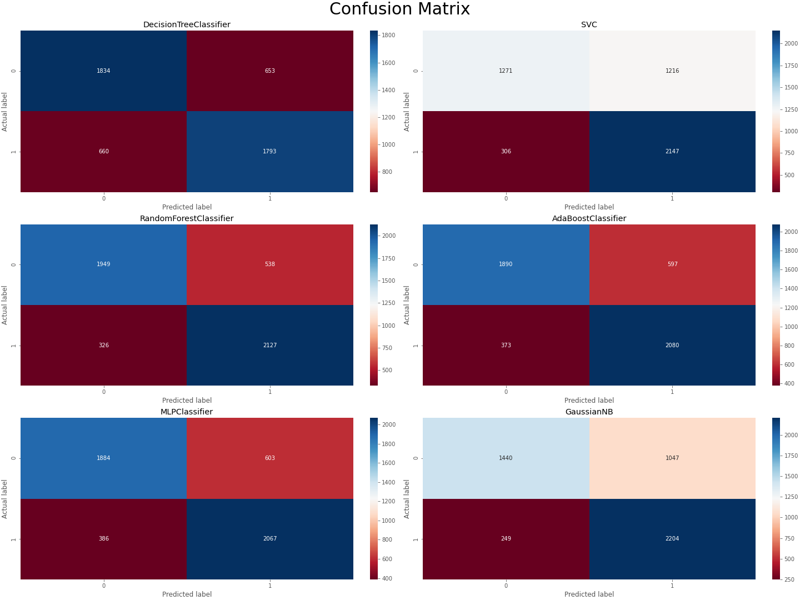

# Spotify Song Hit or Flop Prediction
 

## 목차
- [Introduction](#introduction)
- [Overview of the Data](#overview-of-the-data)
    * [Preprocess](#preprocess)
- [Exploratory Data Analysis](#exploratory-data-analysis)
    * [Numerical Data](#numerical-data)
    * [Categorical Data](#categorical-data)
- [Machine Learning Modeling](#machine-learning-modeling)
    * [Testing algorithm](#testing-algorithm)
    * [Feature Importances](#feature-importances)
    * [Learning Curve](#learning-curve)
    * [Confusion Matrix](#confusion-matrix)
    * [Conclusion](#conclusion)
- [Retrospect](#retrospect)

# Introduction

어떤 곡들이 히트를 할까? 하는 단순 궁금증에서 시작한 프로젝트.
스포티파이 (Spotify) 데이터를 통해서 히트송과 그렇지 않은 곡들의 특성 차이를 알아보고 어떤 곡들이 히트를 할 수 있을지 예측해보는 프로젝트!
히트의 기준은 빌보드의 위클리 리스트에 포함 여부이며 미국 시장 기준이다. 
(https://www.kaggle.com/theoverman/the-spotify-hit-predictor-dataset?select=dataset-of-10s.csv)

# Overview of the Data

- 19개의 컬럼 특성 컬럼과 1개의 타켓 컬 총 20개의 컬럼으로 구성 
- 1960년대부터 2010년대까지 십년단위로 데이터 따로 존재
- 이번 프로젝트에서는 1980년대부터 2010년대까지 총 40년의 데이터를 사용

### Preprocess

- 연도 구분을 위해 'year' 과 단위를 'ms' 에서 's'로 변경하기 위해 'duration_s' 컬럼 추가
- 총 21개의 컬럼 (18개 numerical data, 3개 categorical data)

| Index | Attribute | 
|--- | --- | 
| 1 | track | 
| 2 | artist | 
| 3 | uri |
| 4 | danceability |
| 5 | energy |
| 6 | key |
| 7 | loudness | 
| 8 | mode |
| 9 | speechiness |
| 10 | acousticness |
| 11 | instrumentalness |
| 12 | liveness |
| 13 | valence |
| 14 | tempo |
| 15 | duration_ms |
| 16 | time_signature |
| 17 | chorus_hit |
| 18 | sections |
| 19 | target |
| 20 | year |
| 21 | duration_s |

# Exploratory Data Analysis 

수치적 데이터와 카테고리 데이터 나눠서 히트송과 그렇지 않은 곡의 특성이 무엇이 있을지를 염두해 두면서 탐색을 하였다.

### Numerical Data

- hits와 flop은 danceability, energy, loudness, acousticness, instrumentalness, valence 컬럼에서 다른 양상을 나타내고 있다. 
- 그 중 acousticness, instrumentalness 은 hits의 경우 어떤 공통적인 특성이 크다기 보다는 제각각 다른 분포를 가고 있다.
- danceability, loudness, instrumentalness 이 hits할지 flop할지 가장 영향을 크게 미치고 있다.

- 상관관계 0.5 이상의 컬럼끼리 분표를 보았다. 특성별로 각자의 분포를 꽤 잘 가지고 있는 것으로 보인다.

#### danceability vs valence

#### energy vs acousticness

#### energy vs loudness

#### loudness vs acousticness

#### sections vs duration_s

### Categorical Data

- 전체 데이터에서 가장 많은 트랙을 발매한 아티스트 20개를 뽑아서 아티스트별로 hits와 flop 곡이 얼마나 되는지 확인하였다. 주로 hits 아티스트와 flop 아티스트로 확연히 나뉘어지는 것으로 보인다.

# Machine Learning Modeling

EDA를 통해서 데이터 파악하고 hits 할지 예측하기 위해 머신러닝 모델링을 하였다.

### Testing algorithm

- 총 6가지 모델 (Desicion tree classifier, Support Vector Machines, Random forest classifier, Ada boost classifier, MLP Classifier, GaussianNB) 을 사용하였다. 
- 앙상블 모델인 Random Forest와 Decision Tree가 Train 에서는 좋은 성능을 보였지만 Test 에서는 그렇지 못하여서 과적합으로 판단하엿다. 

### Feature Importances

- Decision Tree, Random Forest, Ada Boost 모델의 feature importances를 살펴보았다.
- 공통적으로 danceability, acousticness, instrumentalness 3가지의 특성이 중요하다고 보여지는데 위의 boxplot에서 볼 수 있듯이 hits의 경우 분포가 제각각이어서 outlier로 간주하여 제거가 어렵다고 판단하였다. 잘못 outlier 제거하였을때 데이터 손상이 올거라고 생각했기 때문이다.

### Learning Curve

### Confusion Matrix

### Conclusion

-  Random Forest 모델이 가장 좋은 성능을 가진 것으로 나왔으나, 과적합으로 보인다.
-  score, learning curve, confusion matrix 를 통해서 보았을때, MLP 가 가장 노멀한 모델로 판단된다.

# Retrospect 

- 전체적인 특성을 조금 더 들여다 보는 EDA가 필요하다. hits or flop 초점을 맞춘 EDA가 주로 진행되었다고 생각한다. 
- 다른 방식으로 outlier 제거하는 방법을 강구해서 모델 강화를 해야한다.
